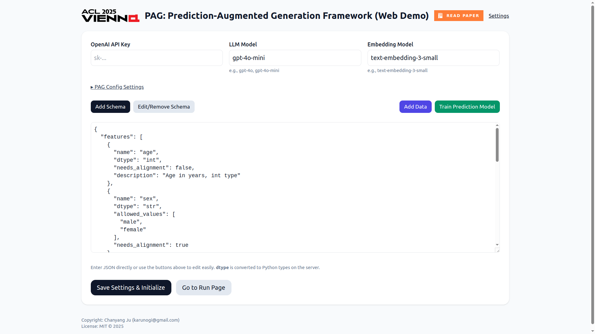
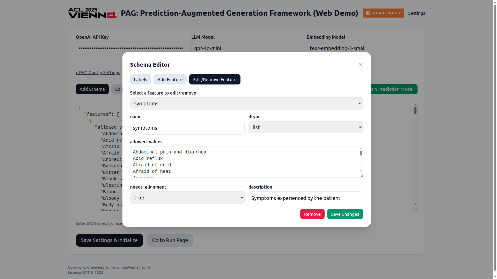
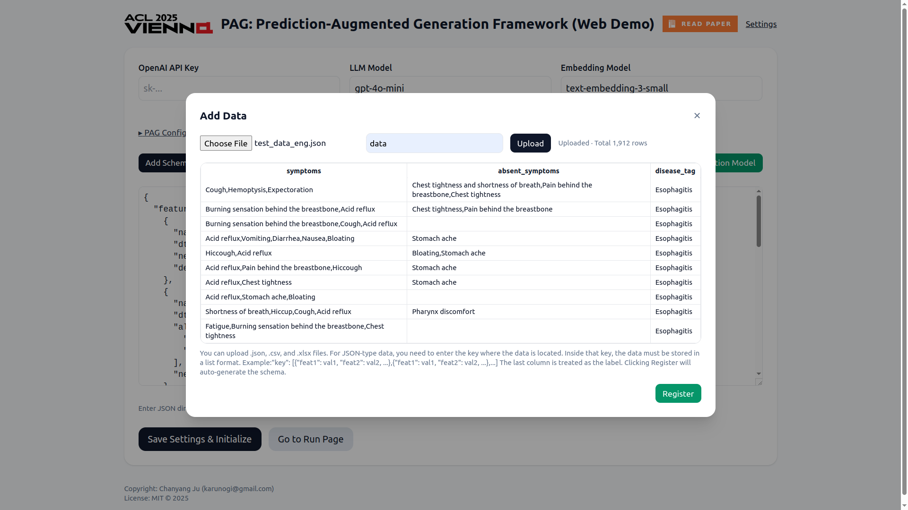
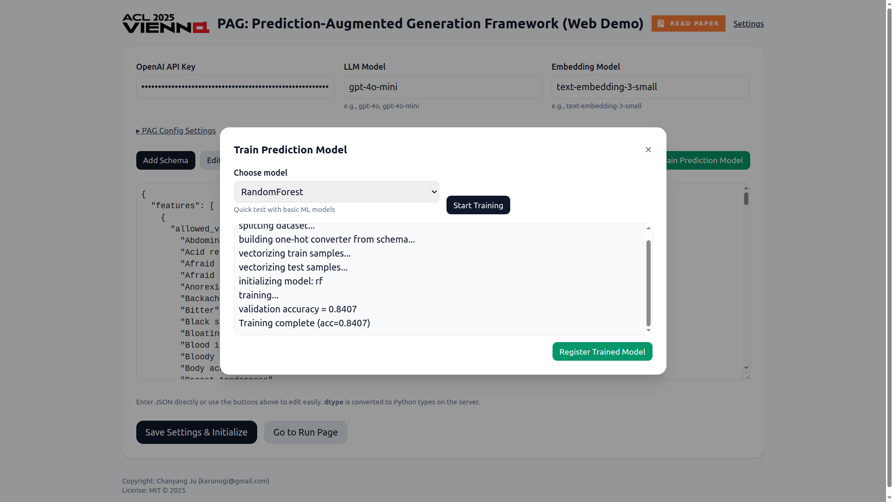
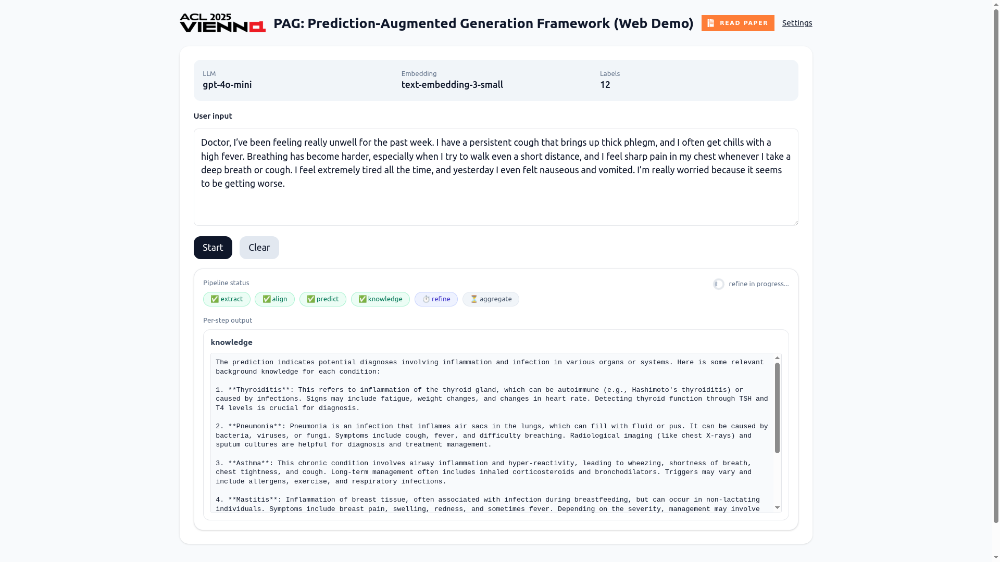

# PAG Demo (Prediction-Augmented Generation)
<p align="left">
  <a href="https://aclanthology.org/2025.findings-acl.732/">
    
  </a>
</p>
A tiny Flask web app that demonstrates a Prediction-Augmented Generation (PAG) pipeline end-to-end: upload data → auto-build a schema → optional quick ML training → run the PAG pipeline (extract → align → predict → knowledge → refine → aggregate) with live streaming updates.  
UI, comments, and copy are in English.

---

## 📑 Table of Contents
- Features  
- Screenshots  
- Project Structure  
- Requirements  
- Quick Start  
- Configuration via Settings  
- Data Upload & Auto Schema  
- Training (Optional)  
- Run the Pipeline  
- How It Works (High Level)  
- Known Limitations  
- Troubleshooting  
- FAQ

---

## 🚀 Features
- Clean, single-page setup for API keys, model names, schema editing, data upload, and training.
- Collapsible “PAG Config Settings” panel to tweak `PAGConfig` and `AlignmentConfig` (stored in-memory).
- Data upload (.csv / .xlsx / .json) with preview and row/column counts.
- Schema auto-generation (last column is label).
- Allowed values editor with robust newline handling.
- One-click ML training (Logistic Regression / Random Forest) with SSE live logs.
- Live pipeline viewer (status badges, result panes, aggregation output).
- Modular Flask app with blueprints and clean architecture.

---

## 🖼 Screenshots
## 🖼 Screenshots

### 🔧 Settings Page


### 📄 Schema Editor


### 📤 Data Upload & Preview


### 🤖 Sample Model Training


### 📈 Generation Progress


### ✅ Final Result Output


---

## 📁 Project Structure
```
pag-demo/
├─ run_app.py
├─ requirements.txt
├─ pag_demo/
│  ├─ __init__.py
│  ├─ state.py
│  ├─ services/
│  │  ├─ __init__.py
│  │  ├─ models.py
│  │  └─ utils.py
│  ├─ routes/
│  │  ├─ __init__.py
│  │  ├─ pages.py
│  │  ├─ pipeline.py
│  │  ├─ data.py
│  │  └─ training.py
│  └─ templates/
│     ├─ base.html
│     ├─ index.html
│     └─ run.html
└─ src/
   └─ PAG.py
```

---

## ⚙️ Requirements
- Python 3.10+
- `pip install -r requirements.txt`
- OpenAI API Key (entered via Settings page)

---

## ⚡️ Quick Start

```bash
# 1) Create & activate a venv
python -m venv .venv
source .venv/bin/activate     # Windows: .\.venv\Scripts\activate

# 2) Install dependencies
pip install -r requirements.txt

# 3) Set Flask secret (optional)
export FLASK_SECRET_KEY="something-random-and-secret"

# 4) Run app
export FLASK_RUN_PORT=7000
python run_app.py

# Open in browser
http://localhost:5000/
```

Health check:  
`GET /healthz` → "ok"

---

## 🧩 Configuration via Settings

- Enter your OpenAI API Key
- Select:
  - LLM Model (e.g., `gpt-4o`)
  - Embedding Model (e.g., `text-embedding-3-small`)
- Edit Schema JSON
- Expand “PAG Config Settings” for advanced options:

### PAG Options
- `top_k_predictions` (int, default 5)  
- `num_schema_categorical` (int, default 10)  
- `short_knowledge` (bool, default True)  
- `knowledge_per_label` (bool, default True)  
- `aggregate_with_pm` (bool, default False)  
- `user_input_with_kg` (bool, default False)  
- `embedding_cache_path` (str, default `./embedding_cache.pickle`)  
- `match_cache_path` (str, default `./match_cache.pickle`)  

### Alignment Options
- `top_k_candidates` (int, default 30)  
- `use_semantic` (bool, default True)  

These values apply inside `ensure_pag_ready()`.

---

## 📂 Data Upload & Auto Schema

- Supported formats: `.csv`, `.xlsx`, `.json`
- JSON format:
  - Top-level `list[dict]`, or
  - `dict` with list under `json_key`
- Preview first 10 rows + total row/col count
- Auto schema: last column = label
- `allowed_values` generated for categorical columns
- Saved as:
  ```python
  STATE.dataset = {
    "X": ...,
    "y": ...,
    "feature_cols": ...,
    "label_col": ...
  }
  ```

---

## 🧠 Training (Optional)

- Choose Logistic Regression or Random Forest
- Live logs via SSE `/train_stream`
- View validation accuracy and click **Register Model**
- Registers model with `TrainedPredictor`
- Aligns probabilities with schema labels
- Enables trained model: `STATE["use_trained"] = True`

---

## 🔄 Run the Pipeline

1. Navigate to **Run** page
2. Enter user input (e.g., symptoms)
3. Click **Start**

You’ll see:
- Step-wise status: `extract → align → predict → knowledge → refine → aggregate`
- Result pane with payloads
- Final aggregation output

Powered by SSE from `/stream`.

---

## 🧬 How It Works (High Level)

### Schema
- Auto-generated or defined via `FeatureSchema` (see `src/PAG.py`)

### Predictive Model
- Default: `DummyPredictor` + `FeatEncoder`
- Optional: `TrainedPredictor`

### PAG Wiring
`ensure_pag_ready()` sets up:
- Schema
- Model
- LLM / embedding backends
- Configs (`PAGConfig`, `AlignmentConfig`)

### Pipeline
`extract → align → predict → knowledge → refine → aggregate`  
Each step pushes logs/results via SSE.

---

## ⚠️ Known Limitations

- Single-user: all state stored in memory (`state.py`)
- No persistence across restarts
- No authentication or secrets management (demo only)
- Assumes last column = label in uploads
- We only support OpenAI in this demo. If you want your own LLM or other api services, use ./src/PAG directly.

---

## 🛠 Troubleshooting

- **"schema_json is required"**  
  Upload data or paste schema manually

- **JSON upload complains about `json_key`**  
  Provide correct key containing data list

- **Labels look like one long line**  
  Edit Feature modal normalizes `\n` → multiline

- **Training says “no dataset”**  
  Upload & register data first

- **No final result**  
  Check API key, schema, and label validity

---

## ❓ FAQ

- **Q: Can I bring my own model?**  
  Yes. Register via UI or modify `services/models.py`.

- **Q: Can I change `embed_fn`?**  
  Not in UI. Override in code if needed.

- **Q: Where are config values stored?**  
  `STATE["pag_cfg"]` and `STATE["align_cfg"]`

- **Q: Is there a REST API?**  
  Core endpoints exist but this is a UI-first demo.


